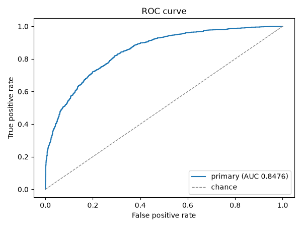
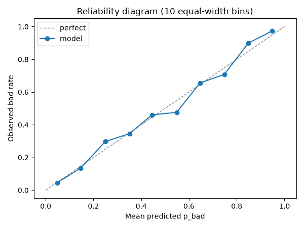
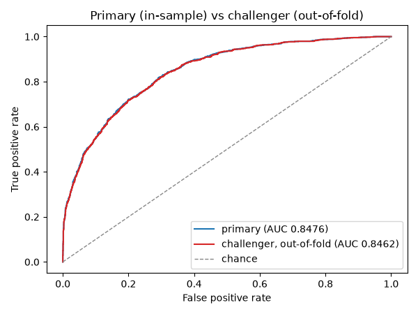

# Validation report: demo-scorecard

Covenant renders this report deterministically: the same model, snapshot and covenants produce byte-identical markdown and figures. Nothing in it is a claim of compliance — Covenant produces evidence; your validators and auditors decide.

## 1. Identity and audit trail

| Field | Value |
|---|---|
| Model name | `demo-scorecard` |
| Model file sha256 | `eb1a24a35ef08f19cdc56a1b539af8a7170c47f89f9098e362a6653a86740b53` |
| Data snapshot sha256 | `4ca209a8e48ed756a9d61ccc586bafff4c548e0ff063ea8e620c138a73f846e6` |
| Covenants sha256 | `0df621880bcbc626f9c2694ffd006292c461bffc53ee328aa794447964736aa5` |
| Snapshot shape | 4000 rows x 12 columns |
| Report config | n_bootstrap=300, n_bins=10, random_state=0, challenger=on |
| Library versions | covenant 0.3.0, numpy 2.5.2, pandas 3.0.5, python 3.12.13, shap 0.52.0, sklearn 1.9.0 |

report_sha256: 3d0598abada9a41b368507fe79b7af11d8cde7f95552fe4fb4497542b43fb803

Verification convention: `report_sha256` is the SHA-256 of this file's bytes after replacing the 64 hex digits on the `report_sha256:` line with 64 ASCII `0` characters. To verify, blank the digest exactly that way, hash the file, and compare. The manifest below embeds each figure's digest in the hashed body, so the one hash transitively covers every PNG.

| Figure | sha256 |
|---|---|
| figures/calibration.png | `0f5e0653d02d7c78fb8e09cb197b103fa0d46125b73f10ab9706d9a6493fbb15` |
| figures/challenger.png | `c98fc38f761e3ae28685cfc3901db252688ca9f4851aadf860775e0443efc663` |
| figures/roc.png | `6862eddb4d839dced9f1cbb4d33b8fbbb337437a9653ce40bb21574ac7e944f1` |

Maps to: the model-inventory and audit-trail asks — the content hashes tie this evidence to one exact model, snapshot and covenants (docs/MAPPING.md).

## 2. Discrimination

Point estimates with 95% bootstrap confidence intervals (300 seeded resamples, seed 0). FINRA's Model Validation Toolkit frames small samples as a credibility problem for point estimates; the interval is the honest number.

| Metric | Point | CI lower | CI upper |
|---|---|---|---|
| AUC | 0.8476 | 0.8352 | 0.8590 |
| Gini | 0.6952 | 0.6703 | 0.7179 |
| KS | 0.5268 | 0.5050 | 0.5556 |



Maps to: the outcome-analysis and ongoing-monitoring asks — discrimination measured with intervals, not bare points (docs/MAPPING.md).

## 3. Calibration

Brier score and expected calibration error over 10 equal-width probability bins, each with a 95% bootstrap confidence interval (300 seeded resamples, seed 0).

| Metric | Point | CI lower | CI upper |
|---|---|---|---|
| Brier | 0.1442 | 0.1383 | 0.1505 |
| ECE (10 bins) | 0.0208 | 0.0162 | 0.0368 |



Maps to: the outcome-analysis ask — predicted probabilities compared with observed outcomes (docs/MAPPING.md).

## 4. Stability

A single snapshot was supplied, so train-to-holdout stability cannot be measured — one sample has nothing to be stable against. Pass a holdout snapshot (CLI: `--holdout`) to render the score PSI and the per-feature CSI table.

Maps to: the ongoing-monitoring and drift asks — population stability between the snapshots supplied (docs/MAPPING.md).

## 5. Drift

The snapshot is sorted by `application_month` (stable sort) and split into four equal row-count slices; each later slice's scores are compared with the first slice's by PSI. The RBI FREE-AI survey found only about a fifth of AI-using regulated entities monitored drift (as documented in docs/research-guide.md); this table is the low-cost version of that habit.

| Slice | Rows | application_month range | PSI vs slice 1 |
|---|---|---|---|
| 1 (baseline) | 1000 | 1 - 4 | - |
| 2 | 1000 | 4 - 7 | 0.0134 |
| 3 | 1000 | 7 - 10 | 0.0256 |
| 4 | 1000 | 10 - 12 | 0.0153 |

Maps to: the drift-monitoring ask (docs/MAPPING.md).

## 6. Monotonicity

Verdict: **PASS** — worst violation rate 0.0000 against the declared threshold max_violation_rate = 0.0500, with 0 configured-constraint mismatch(es). A verdict is a rate against a threshold the covenants declare, not a compliance claim. Check record sha256: `a53403ac1a13919c8c943b3b50cbcdf2d4e1ac8c8bfaf6a26839ff4d8598b864`.

| Feature | Declared | Configured | Pair violation rate | ICE violation rate |
|---|---|---|---|---|
| income | decreases_risk | absent | 0.0000 | 0.0000 |
| dti | increases_risk | absent | 0.0000 | 0.0000 |
| utilization | increases_risk | absent | 0.0000 | 0.0000 |
| delinquencies_24m | increases_risk | absent | 0.0000 | 0.0000 |
| inquiries_6m | increases_risk | absent | 0.0000 | 0.0000 |
| age_of_oldest_line_months | decreases_risk | absent | 0.0000 | 0.0000 |
| loan_amount | increases_risk | absent | 0.0000 | 0.0000 |
| employment_years | decreases_risk | absent | 0.0000 | 0.0000 |

Maps to: the conceptual-soundness ask — declared behaviour tested against measured behaviour (docs/MAPPING.md).

## 7. Challenger

The challenger is a plain logistic pipeline (one-hot encoding, scaling, logistic regression) predicted out of fold via 5-fold stratified cross-validation, seed 0. Deltas are primary minus challenger with paired bootstrap intervals (300 resamples on identical rows for both models).

| Metric | Primary | Challenger | Delta (primary - challenger) | 95% CI |
|---|---|---|---|---|
| AUC | 0.8476 | 0.8462 | 0.0014 | [0.0009, 0.0020] |
| KS | 0.5268 | 0.5218 | 0.0051 | [-0.0014, 0.0080] |

Honesty asymmetry, stated so the table cannot oversell: the challenger is scored out of fold while the primary model is scored in-sample on the same snapshot, which flatters the primary. Read the comparison as a floor for the challenger, not a horse race — a positive delta turns "our model beats the simple thing" into a measured claim with an interval.



Maps to: the outcome-analysis ask — benchmarking against a simpler alternative, with an interval (docs/MAPPING.md).

## 8. Reproduce this report

```
covenant report model.joblib train.csv --covenants covenants_fixed.yaml
```

`--out` chooses the destination directory and does not change the rendered bytes: re-running with the same model, snapshot and covenants reproduces this file and every figure byte for byte.

Covenant produces evidence; your validators and auditors decide.

Maps to: the audit-trail ask — a replayable invocation over hash-identified inputs (docs/MAPPING.md).
